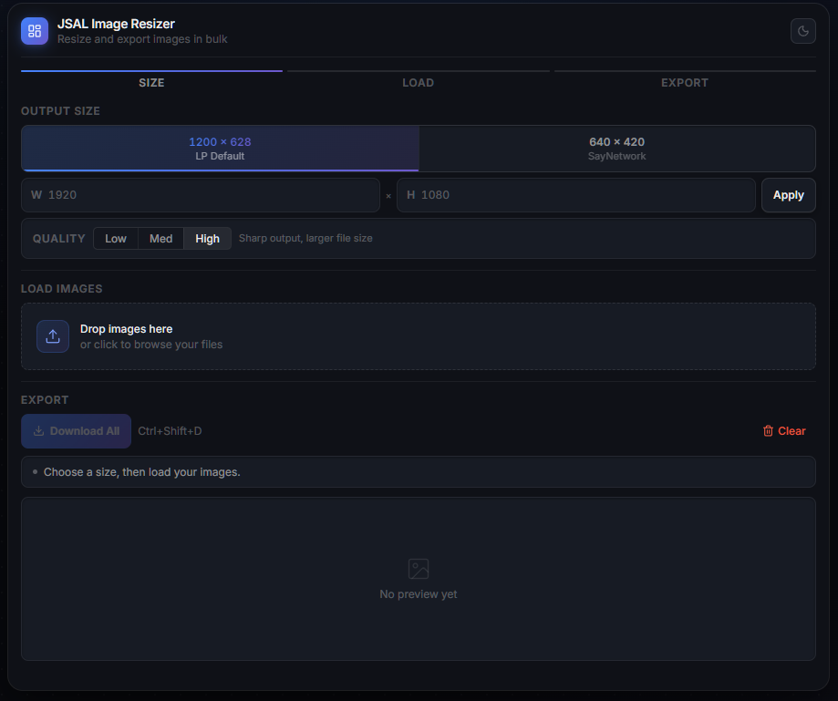
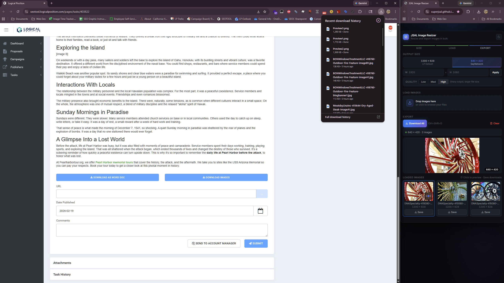

# Image Resizer

A lightweight, browser-based tool for resizing and exporting images in bulk for SFB and LFB Blogs.



---

## Features

- **Bulk resize** — load multiple images at once and export them all in one click
- **Preset sizes** — one-click presets for common formats (LP Default 1200×628, SayNetwork 640×420)
- **Custom dimensions** — enter any width/height up to 20,000px
- **Crop anchor picker** — a 3×3 dot grid on each thumbnail lets you control exactly where the crop is taken from (top-left, center, bottom-right, etc.) per image
- **Quality control** — Low / Med / High JPEG compression settings (Suggest to keep it on High as 99% of the time we are downscaling.)
- **Live preview** — full-size canvas preview updates instantly when you change size, quality, or crop anchor
- **Individual save** — download any single image straight from its card
- **Download All** — exports every image at once (`Ctrl+Shift+D` / `⌘⇧D`)
- **Light & dark mode** — persists across sessions via localStorage
- **Remembers your settings** — last used size and quality are restored on next visit

---

## Usage

No build step, no install. Just open `index.html` in a modern browser.

```
image-resizer/
├── index.html
├── script.js
└── styles.css
```

1. **Pick a size** — choose a preset or enter custom dimensions and hit Apply
2. **Load images** — drag & drop or click to browse. Adding more images while some are loaded will ask whether to replace or add
3. **Adjust crop anchors** — hover any card to reveal the 3×3 picker in the corner. Dimmed dots mean that axis has no slack (the image already fills it completely)
4. **Export** — hit Download All or save individual images from their cards

Ideally best used as a Sidebar if doing a lot of Blogs, ie:



---

## Adding a Preset Size

In `index.html`, copy any `seg-btn` and set the `data-size` attribute:

```html
<button class="seg-btn" data-size="1200x675">
  <span class="seg-label">1080 × 1080</span>
  <span class="seg-hint">Florida Villager</span>
</button>
```

No JS changes needed.

---

## How Cropping Works

Images are always scaled to **fill** the output size completely (no letterboxing). When the source aspect ratio doesn't match the target, the excess is cropped. The anchor picker controls which part of the image is kept:

- The **center dot** (default) crops from the middle
- The **top-left dot** keeps the top-left corner
- **Dimmed dots** mean that axis is fully covered and you will not be able to crop.

---

## Browser Support

Works in any modern browser that supports the Canvas API and `createImageBitmap`. Chrome, Firefox, Safari, and Edge all work fine.

---

## Tech

- Vanilla JS (no frameworks)
- Canvas API for image processing
- [Lucide](https://lucide.dev) for icons (loaded via CDN)
- Inter via Google Fonts
- localStorage for persisting preferences
